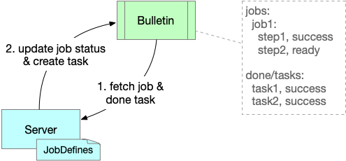

# TasCreed Overview

## Story

When you want to execute a **job**, you would like to get this commitment: **job** is executed once and only once.

There are lots of possible job execution exceptions, so we can hardly guarantee it runs exactly once, but we can run it at least once, with the idempotency of job execution, then it will perform the same as exactly once.

TasCreed provides the ability to execute a **job** at least once, the jobs are recommended to be idempotency, to avoid incorrect result or side effect if the job runs several times.

The progress is like this:
1. User submits a **job request**, *job server* will create a **job** instance from the pre-defined **job define**.
2. When **job** is created, user will receive the job submit success response, and the **job** will be submitted to the *bulletin* storage.
3. *Job server* reads the **job** on *bulletin*, create **task** for each independent **step**.
4. *Task worker* picks **task** from *bulletin* to execute, keeps heartbeat on *bulletin* to announce its occupation and alive state. Please be noted that, there might be multiple task workers executing the same **task**, so the tasks should be idempotent.
5. When all the **tasks** created from a **job** are executed, *job server* will collect the task states and update job state. User can get the job execution state by querying job state from *job server*.

## Terminology

| Name | Description | Produced By | Consumed By |
| ----- | ----- | ----- | ----- |
| Job Define | definition of job | engineer | server |
| Step Define | definition of step | engineer | server | 
| Job Request | request to trigger a job | user | server |
| Job | job instance to execute | server | server |
| Step | step of job instance to execute | server | server |
| Task | sharding of step to be actually executed by worker | server | worker |
| Params | params of step define, request, step and task | server, user | server, worker |
| Job Server | server to manage jobs and tasks | | |
| Task Worker | worker to execute tasks | | |
| Bulletin | storage of job and task information, and task adoption | | |

## Concept
The concepts of domain entities.


### Job Define
Job define is pre-defined in job server, as job template, with `jobName` to identify the specific job, `steps` list to define all the job steps.

sample:
```
{
  "jobName": "balance-report",
  "steps": [...],
  "version": 1
}
```

### Step Define

Step define is pre-defined in job server, as step template, included in `job define`, with `stepName` to identify the specific step, `sharding` to define the parallel of step execution, `dependentStep` to define the dependency of the step, and `params` of the step.

sample:
```
{
  "stepName": "merge_sharding_files_and_upload",
  "sharding": 12,
  "dependentStep": "generate_files_and_upload_by_sharding"
}
```

### Job Request

Job request is submitted to job server by user, to create a new job instance. With `jobName` to identify which job need to create, `trigger` to identify the specific trigger id, `jobName` and `trigger` determines the unique job instance. With `steps` as user preferred step params, to overwrite the default params defined in `step define`.

sample:
```
{
  "jobName": "balance-report"",
  "trigger": "20191031",
  "steps": [
    "stepName": "balance-report-calculate",
    "params": {
      "param1": "value1",
      "param2": "value2"
    }
  ]
}
```

### Job
Job is created based on the job define and job request. With `jobName` and `trigger` to identify a unique job, `steps` list built by `step defines` in `job define`, `state` to indicate the job state.

sample:
```
{
  "jobName": "balance-report",
  "trigger": "20191113", 
  "steps": [...],
  "state": "SUCCESS"
}
```

### Step
Step is created based on the step define. With `name` to identify the specific step, `state` to indicate the step state, `taskStates` to indicate all the sharding task states, and `params` of the step.

sample:
```
{
  "name": "balance-report-calculate",
  "state": "SUCCESS",
  "taskStates": {
    "3": "SUCCESS",
    "4": "SUCCESS",
    "2": "SUCCESS",
    "1": "SUCCESS"
  },
  "params": {
    "REQUEST": "..."
  }
}
```

### Task
Task is created based on the step, as one of the sharding task to be executed. With `jobName`, `trigger` and `stepName` to identify the step, and `sharding` to identify the sharding information, as well as `params` and `result` of the task.

sample:
```
{
  "jobName": "balance-report",
  "trigger": "20200121200001",
  "stepName": "balance-report-calculate",
  "sharding": {
    "total": 12,
    "index": 9
  },
  "params": {
    "REQUEST": "{\"triggerId\":\"20200121200001\",\"reportDate\":\"2020-01-21\"}",
    "host": "9"
  },
  "createTime": "2020-01-23T04:14:44.900Z"
}
```

### Params
Params is a KV map to help on the task execution. Default params can be defined in `step define`, users can also overwrite the params in `job request`, then the specific params are created in `step`, and passed through to `task`.


## Role
The roles of entities.


In TasCreed application, there are two instance roles: `job server` and `task worker`.

### Job Server
Job server works as a web server, to manage all the jobs and tasks. Job server receives the job request, to create jobs and tasks, and update job status.

### Task Worker
Task worker works as a work thread, to adopt and execute a task, and update the task status.

### Bulletin
Bulletin works as a storage, to keep the job and task information, and the task adoption mapping.

## Process
The processes of job and task lifecycle.

### Job Trigger


1. User submit a job request.
2. Server create a job and undependent tasks into bulletin.

### Task Execution


1. Worker fetch todo tasks from bulletin.
2. Worker adopt a todo task, mark the adoption in bulletin, periodically heartbeat to keep the adoption.
3. Worker execute the adopted task.
4. After execution, worker update the task status, move the task to done task list in bulletin, and remove the adoption info.

### Job Update



1. Server fetch jobs and done tasks from bulletin.
2. Server update the job status by done tasks, and create more undependent tasks into bulletin.

## Threads
In each TasCreed instance, there is 1 job server component, 1 job watcher thread, 1 task watcher thread, and several task worker threads, with `tascreed.worker.max.count.per.host` configurable.

### Job Server
Job server is the component to receive job request, create job and undependent tasks, it handles the job trigger process.

### Job Watcher
Job watcher is the thread to update the job status, and create more undependent tasks, it handles the job update process.

### Task Watcher
Task watcher is the thread to adopt task, and build a worker thread for execution.

### Task Worker
Task worker is the thread to execute a task, with associated heartbeat thread to keep adoption information in bulletin.  
The task watcher thread, task worker and heartbeat threads work together to handle the task execution process.


