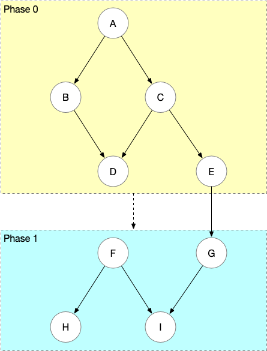

# Phase

**from 0.2.8-RELEASE**

## What is phase

Phase is a new introduced attribute to describe step dependency.  

At current, the step dependency is described as a list of step names in `dependency.steps`, a step can start only after its all dependent steps done. The steps will be organized as a DAG, based on the dependency relationship defined.

Imagine that we can separate the DAG into several phases, with a weaker dependency relationship. Each step belongs to a phase, a phase can start only after its previous phases done.

The trigger condition of dependent step and phase are the same, the difference is that the result state of dependent steps can impact the current step, but the phase dependency will not inherit the result state.

## Example



The job define of the DAG as illustrated could be like this:
```json
{
  "jobName": "dag",
  "steps": [
    {
      "stepName": "A"
    },
    {
      "stepName": "B",
      "dependency": {
        "steps": ["A"]
      }
    },
    {
      "stepName": "C",
      "dependency": {
        "steps": ["A"]
      }
    },
    {
      "stepName": "D",
      "dependency": {
        "steps": ["B", "C"]
      }
    },
    {
      "stepName": "E",
      "dependency": {
        "steps": ["C"]
      }
    },
    {
      "stepName": "F",
      "dependency": {
        "phase": 1
      }
    },
    {
      "stepName": "G",
      "dependency": {
        "phase": 1,
        "steps": ["E"]
      }
    },
    {
      "stepName": "H",
      "dependency": {
        "phase": 1,
        "steps": ["F"]
      }
    },
    {
      "stepName": "I",
      "dependency": {
        "phase": 1,
        "steps": ["F", "G"]
      }
    }
  ]
}
```

Let's have a look at the dependency of this DAG.
- phase 0 is the first phase, phase 1 depends on phase 0.
- if `phase` not set, it is in phase 0 by default.
- the explicit dependency can across different phases, like step `G` in phase 1 explicitly depends on step `E` in phase 0. Step `G` starts after `E` is done, and the result state of `E` will impact `G` as well. That is the main difference between the explict dependency and phase dependency.
- the steps in phase 1 will start only after all the steps in pahse 0 are done.
- if a step in smaller phase depends on a step in bigger phase, the job define will fail the validation, which means it is invalid. For example, if step `B` depends on step `H`, there will be a implicit circle in the DAG, so it is invalid.
- the phase number is unnecessary to be continuous, but it should not be negative number. For example, in a job define, we can only have phase 3 and 5, without configuring phase 0, 1, 2, 4. The execution order is from small phase to large one, that's all.

## Why we need the phase feature

*For better description, let's call the dependency relationship configured by `dependency.steps` as explicit dependency, and the dependency relationship configured by `phase` as phase dependency.*

It is not a common usage, but it does help in some special cases.
- as we know, in explicit dependency, the step result state will impact the later steps. For example, if step `C` is `FAILED`, then step `D` will be `SKIP_BY_FAILED` if it can not fail. Sometimes we might need a final step to send email or do some notification task, no matter the results of previous steps are success or not. Such a final step can be defined in a larger phase, it will be triggered after all the previous steps done, and this step will not be skipped, even if there's any failed or error step.
- similarly, a preparaion phase can help if we need to do some initialization task, and the normal steps should start no matter the init result is success or not.

Furthermore, another feature is also enabled together with the phase feature: the result state of the explicit dependent and phase dependent steps will be passed to the tasks. It means each task executor will have the context of the result states of its dependent steps.  

With this feature, the task executor can implement the `if else` branch logic according to the result of its dependent step is success or failed. It will be more flexible to build the workflow for several conditional branches, if the condition is determined by the previous result states. (If the condition needs to check the result in numeric or string format, it is better to leverage the existed feature of updated param, it can be updated by each task, and will be seen by all the later tasks.)
