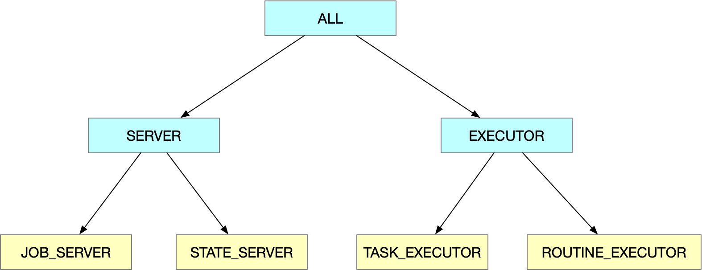

# Node Duty Control

**from: 0.3.2-RELEASE**

A TasCreed application can be deployed in multiple nodes, even in multiple DCs(data centers). In some conditions, each node can perform differently:
- during new release period or some unknown issue of deployment, there could be several versions of manifests deployed at the same time, users might expect only the manifests with a valid version can work.
- if the performance of task execution is important, and different DC nodes performs differently due to the network locacity, users might expect only the nodes within a local DC can work.

To better support these use cases, we've defined the node duties and the control rules, to guide the TasCreed application nodes work or not.

## Node duty
[Reference code](../../../tascreed-core/tascreed-domain/src/main/java/com/ebay/magellan/tascreed/core/domain/duty/NodeDutyEnum.java)

The node duties are defined as a tree, each duty is a tree node.



The parent duty covers child duties, and only the leaf ones are the real duties can be enabled or disabled.

Till now, a TasCreed node has 4 real duties:
- `JOB_SERVER`: if disabled, users can not submit/update/retry a job through this node, and this node can not refresh job states in background
- `STATE_SERVER`: if disabled, users can not invoke all the non-get APIs in state controller, including the functionalities of ban, delete adoption/task/job, etc.
- `TASK_EXECUTOR`: if disabled, this node can not occupy/execute any task.
- `ROUTINE_EXECUTOR`: if disabled, this node can not occupy/execute any routine.

For simplicity, the parent duties are defined for simpler configuration.
- `SERVER`: covers `JOB_SERVER` and `STATE_SERVER`
- `EXECUTOR`: covers `TASK_EXECUTOR` and `ROUTINE_EXECUTOR`
- `ALL`: covers `SERVER` and `EXECUTOR`

## Node duty rule
[Reference code](../../../tascreed-core/tascreed-domain/src/main/java/com/ebay/magellan/tascreed/core/domain/duty/NodeDutyRule.java)

The node duty rule describes several filter conditions to identify a node is valid or not, and a list of duties to be disabled if a node is invalid.

### Valid node filter conditions

- `minValidVersion`: the minimum valid TasCreed version; if the TasCreed version of this node is smaller than it, this node is invalid. By default it is `null`, which means it will not be checked.
- `validHostNameRegex`: the valid host name regex; if the host name of a node can not match the valid regex, this node is invalid. By default is is `null`, which means it will not be checked.

**from: 0.3.3-RELEASE**

Some changes take effect from 0.3.3-RELEASE
- change `minValidVersion` to `minValidTcVersion`, explicitly idicate the validation of TasCreed version. `minValidVersion` is also available for compatibility, as an alias of `minValidTcVersion`.
- `minValidAppVersion`: the minimum valid app version; similar to the `minValidTcVersion`, but this version validation will check the version of user application. By default it is `null`, which means it will not be checked.

Please be noted that, TasCreed infra has to read the user application version via `org.springframework.boot.info.BuildProperties`, so the user application's pom file should contain the `spring-boot-maven-plugin` with the `build-info` goal. Otherwise, the application version will be identified as `null`, if you've configured `minValidAppVersion` with a non-blank string, all your nodes will be identified as invalid.
```
<plugin>
    <groupId>org.springframework.boot</groupId>
    <artifactId>spring-boot-maven-plugin</artifactId>
    <executions>
        <execution>
            <id>build-info</id>
            <goals>
                <goal>build-info</goal>
            </goals>
        </execution>
    </executions>
</plugin>
```

**from: 0.3.4-RELEASE**

- `invalidHostNameRegex`: the invalid host name regex, similar to the `validHostNameRegex`, but with an opposite meaning; if the host name of a node matches the valid regex, this node is invalid. By default is is `null`, which means it will not be checked.

### Disable duties for invalid node

- `disableDutiesIfInvalid`: the duties to be disabled if the node is invalid. The list of duties can include real duties or parent ones.

### Example

A sample node duty rule can be like this:
```json
{
  "minValidTcVersion": "0.3.2-RELEASE",
  "validHostNameRegex": "lvs-.*",
  "disableDutiesIfInvalid": ["SERVER", "TASK_EXECUTOR"]
}
```
With this rule, if a node is invalid, it can not serve as a server, or execute any task, but it can execute the routines.

## APIs of node duty rules

The APIs of node duty rules are defined [here](../../../tascreed-core/tascreed-infra/src/main/java/com/ebay/magellan/tascreed/core/infra/controller/StateController.java#L376-L413).

To submit the duty rules, a sample payload could be like this:
```json
{
  "rules": [
    {
      "minValidTcVersion": "0.3.2",
      "minValidAppVersion": "1.5.2-RELEASE",
      "disableDutiesIfInvalid": ["ALL"]
    }
  ]
}
```
Multiple rules can be submitted, for better flexibility. All the rules will be applied to each node to check if it is valid for the specific duties.
